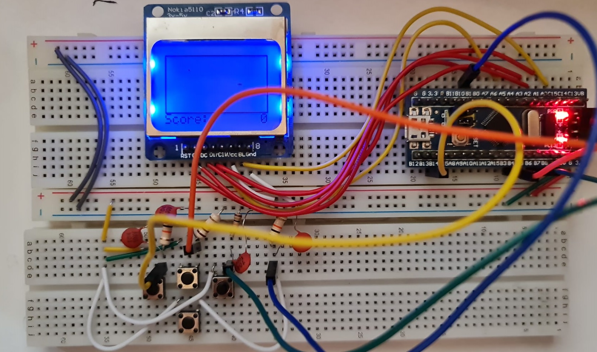

# Snake-Game-STM32F103-
Classic Snake game implementation on an STM32F103 (Bluepill) microcontroller with Nokia 5110 LCD screen

## Required Parts
* STM32F103C8 MCU                           x1
* Nokia 5110 LCD screen                     x1
* Push button                               x4
* 10k resistor (for pulldown)               x4
* 10uF ceramic capacitor (for debouncing)   x4
* Jumper wires

